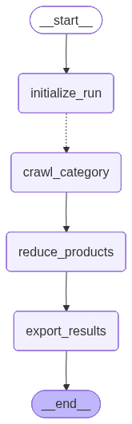
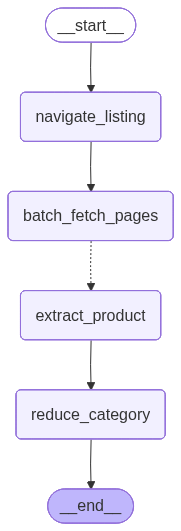
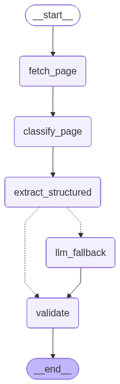

# Safco Dental Agentic Product Scraper

A LangGraph-based multi-agent scraping system that extracts structured product catalogs from [Safco Dental Supply](https://www.safcodental.com) for two categories: **Dental Exam Gloves** and **Sutures & Surgical Products**.

---

## Architecture Overview

The system is composed of three nested graphs. The Main Graph orchestrates two Category Subgraphs in parallel; each Category Subgraph fans out to N Product Subgraphs — one per URL — via its `extract_product` node.

```
┌─ MAIN GRAPH (AsyncSqliteSaver checkpointing) ──────────────────────────────┐
│                                                                              │
│  START → initialize_run                                                      │
│               │                                                              │
│               ├─ Send() ──► crawl_category [Dental Exam Gloves]  ──┐        │
│               │                                                     ├─► reduce_products → export_results → END
│               └─ Send() ──► crawl_category [Sutures & Surgical]  ──┘        │
│                             (both run in parallel)                           │
│                                                                              │
│  Each crawl_category node runs the Category Subgraph below                  │
└──────────────────────────────────────────────────────────────────────────────┘

┌─ CATEGORY SUBGRAPH (one instance per category) ────────────────────────────┐
│                                                                              │
│  navigate_listing                                                            │
│  (Playwright intercepts Algolia key → HTTP pagination → product URLs        │
│   + structured hit data: name, SKU, price, brand, images, stock)            │
│               │                                                              │
│  batch_fetch_pages                                                           │
│  (TavilyExtract → clean markdown for ALL URLs, batched before fan-out)      │
│               │                                                              │
│               ├─ Send() ──► extract_product [URL 1]  ─┐                     │
│               ├─ Send() ──► extract_product [URL 2]   │                     │
│               ├─ Send() ──► extract_product [URL 3]   ├─► reduce_category → END
│               └─ Send() ──► extract_product [URL N] ──┘                     │
│                             (all run in parallel)                            │
│                                                                              │
│  Each extract_product node runs the Product Subgraph below                  │
└──────────────────────────────────────────────────────────────────────────────┘

┌─ PRODUCT SUBGRAPH (one instance per URL, runs inside extract_product) ─────┐
│                                                                              │
│  fetch_page                                                                  │
│  (use pre-fetched Tavily content if available;                               │
│   else individual Tavily call; else httpx → Playwright as last resort)      │
│       │                                                                      │
│  classify_page                                                               │
│  (skip if Algolia data present → auto product_detail;                       │
│   else URL-depth heuristic → LLM only if still ambiguous)                   │
│       │                                                                      │
│  extract_structured                                                          │
│  (Algolia scalars win: name, SKU, price, brand, images, stock;              │
│   LLM extracts from Tavily markdown: description, specs,                    │
│   unit_pack_size, alternative_products — ~700 input tokens)                 │
│       │                                                                      │
│       ├─[Algolia missing AND no page content]──► llm_fallback               │
│       │                                                                      │
│  validate                                                                    │
│  (dedup by url_hash, reject records with missing names)                     │
│       │                                                                      │
│      END  (result returned to reduce_category in parent graph)              │
└──────────────────────────────────────────────────────────────────────────────┘
```

### Graph Visualisation

**Main Graph** — `crawl_category` is where the Category Subgraph runs (one instance per category, both in parallel via `Send()`).



**Category Subgraph** (runs inside `crawl_category`) — `extract_product` is where the Product Subgraph runs (one instance per URL, all in parallel via `Send()`).



**Product Subgraph** (runs inside `extract_product`) — dashed edge from `extract_structured` to `llm_fallback` is the conditional last-resort path.



---

**Two key design discoveries drove the architecture:**

1. **Algolia API for product discovery**: Safco uses the Algolia search API to hydrate its product grids. The Navigator intercepts a session API key via Playwright, then queries Algolia directly over pure HTTP — returning rich structured JSON (name, SKU, price, brand, images, availability, categories) across all pages without any CSS parsing.

2. **Tavily for page content**: All product detail pages are batch-fetched via TavilyExtract before any product task runs. Tavily returns clean **markdown** instead of raw HTML — the LLM extracts description, specs, pack size, and related products in ~700 tokens vs ~1500 for noisy HTML, and there are no CSS selectors to maintain.

---

## Why This Approach

| Decision | Alternative | Reason |
|---|---|---|
| Algolia API (via intercepted session key) | CSS scraping the product grid | Algolia gives structured JSON for every product — name, SKU, price, brand, images, stock — without fragile selectors. One Playwright call per category to capture the key; all pagination via plain HTTP. |
| TavilyExtract batch pre-fetch | httpx + BeautifulSoup per product | Tavily handles JS-rendered pages, returns clean markdown, and supports batch calls. Pre-fetching all URLs before the fan-out eliminates per-product browser launches on the happy path. |
| LLM on clean markdown, not raw HTML | Full CSS extraction pipeline | The supplementary extraction prompt receives ≤3000 chars of Tavily markdown with Algolia context already prepended. The LLM only needs to find 4 fields (description, pack size, specs, alternatives) — token cost stays at ~700 input tokens per product. |
| Deterministic LangGraph graph | ReAct agent loop | The pipeline is fully deterministic: navigate → batch fetch → extract → validate → persist. `Send()` fan-out gives true parallelism without LLM routing overhead or non-determinism. |

---

## Agent Responsibilities

| Agent | File | Responsibility |
|---|---|---|
| **Navigator** | `agents/navigator.py` | Launches Playwright once per category to intercept the Algolia session key, then queries Algolia via HTTP with `facetFilters` across all pages to build `product_urls` + `algolia_hits`. Falls back to Playwright HTML scraping if key interception fails. |
| **Page Classifier** | `agents/classifier.py` | Determines page type with URL-depth heuristics first; calls the LLM only for ambiguous pages. Handles both markdown and raw HTML inputs. Skipped entirely when Algolia data is present. |
| **Extractor** | `agents/extractor.py` | Merges Algolia scalar fields (name, SKU, price, brand, images, stock) with LLM-extracted supplementary fields (description, unit_pack_size, specifications, alternative_products) from Tavily markdown. Full LLM fallback when neither Algolia nor Tavily content is available. |
| **Validator** | `agents/validator.py` | Deduplicates by SHA256(url) and rejects records with missing or too-short names. |
| **Storage** | `storage/db.py` + `storage/exporter.py` | Idempotent SQLite upsert keyed on `url_hash` (`INSERT OR REPLACE`). Reads DB with pandas to export CSV and JSON at run end. |

---

## Setup & Execution

### Requirements

- Python 3.11+
- **OpenAI** API key — used by `extract_structured` (supplementary LLM call on every product) and optional classifier/fallback
- **Tavily** API key — used by `batch_fetch_pages` and individual `fetch_page` fallback
- **LangSmith** API key — optional; enables LangGraph tracing

### Install

```bash
# 1. Install uv (fast Python package manager)
pip install uv

# 2. Create and activate a virtual environment
uv venv
# Windows:
.venv\Scripts\activate
# macOS / Linux:
source .venv/bin/activate

# 3. Install all pinned dependencies
uv pip install -r requirements.txt

# 4. Install the Playwright browser
playwright install chromium
```

### Secrets Management

API keys are loaded from a `.env` file via `python-dotenv`. **Never commit `.env` to source control** (it is in `.gitignore`).

```bash
cp .env.example .env
```

Edit `.env` and set:

```
OPENAI_API_KEY=sk-...        # required
TAVILY_API_KEY=tvly-...      # required
LANGSMITH_API_KEY=ls__...    # optional
```

In production, replace `.env` with a secrets manager (AWS Secrets Manager, GCP Secret Manager, HashiCorp Vault). The application reads keys from environment variables, so any injection mechanism works without code changes.

### Config-Driven Execution

All runtime behaviour is controlled by `config.yaml` — no code changes needed to tune the scraper:

```yaml
scraper:
  max_pages_per_category: 20        # Algolia pagination limit
  max_products_per_category: 500    # URL collection cap
  delay_between_requests_ms: 1200   # Rate limiting between requests
  max_concurrent_products: 3        # Playwright semaphore (fallback path only)
  tavily_batch_size: 5              # URLs per Tavily batch API call
  tavily_extract_depth: "advanced"  # "basic" | "advanced"

llm:
  model: "gpt-4o-mini"
  max_tokens: 2048
  temperature: 0.0
```

### Run

```bash
# Full scrape (both categories)
python main.py

# Quick test — ~25s for 6 products per category
python main.py --max-products 6

# Fresh run — ignore previously scraped products
python main.py --fresh

# Resume a crashed/interrupted run
python main.py --resume <run_id>

# Scrape a single category
python main.py --categories "Dental Exam Gloves"
```

Output is written to `./output/`:

| File | Description |
|---|---|
| `safco_products.db` | SQLite database (queryable) |
| `safco_products.csv` | Flat CSV export |
| `safco_products.json` | Nested JSON export |

### Query the database

```bash
sqlite3 output/safco_products.db \
  "SELECT category, COUNT(*), SUM(CASE WHEN description IS NOT NULL THEN 1 ELSE 0 END) FROM products GROUP BY category;"

sqlite3 output/safco_products.db \
  "SELECT name, sku, price, brand FROM products WHERE category='Dental Exam Gloves' LIMIT 10;"
```

---

## Sample Output Dataset

A live sample of 20 scraped products (10 per category) is included in the `output/` directory:

| File | Description |
|---|---|
| `output/safco_products.json` | Nested JSON — full field structure per product |
| `output/safco_products.csv` | Flat CSV — all fields, JSON columns serialised as strings |
| `output/safco_products.db` | SQLite database — queryable with standard SQL tools |

Generated with `python main.py --max-products 10` (run `8310ed19`, 2026-04-24):

| Category | Products | With Description |
|---|---|---|
| Dental Exam Gloves | 10 | 10 |
| Sutures & Surgical Products | 10 | 10 |

**Run timing:**

| Phase | Duration |
|---|---|
| Algolia key extraction + URL collection (both categories, parallel) | ~13s |
| Tavily batch pre-fetch — all 20 URLs in batches of 5 (both categories, parallel) | ~13s |
| Product extraction — LLM supplementary calls (all 20 URLs, parallel) | ~9s |
| **Total** | **35s** |

The Tavily batch pre-fetch is the dominant cost and scales with `tavily_batch_size` (default 5 URLs per API call). The per-product LLM step is fast because all 20 tasks fan out simultaneously. At this rate, 100 products would take roughly ~3–4 minutes.

To reproduce or extend the sample, see the [Run](#run) section below.

---

## Output Schema

| Field | Type | Source |
|---|---|---|
| `url_hash` | TEXT (PK) | SHA256(url) — idempotency key |
| `url` | TEXT | Algolia hit |
| `run_id` | TEXT | Config |
| `category` | TEXT | Config |
| `category_hierarchy` | JSON array | Algolia `categories.level1` split by `///` |
| `name` | TEXT | Algolia `name` |
| `brand` | TEXT | Algolia `manufacturer_name` |
| `sku` | TEXT | Algolia `sku` |
| `price` | TEXT | Algolia `price.USD.default_formated` |
| `unit_pack_size` | TEXT | LLM from Tavily markdown |
| `availability` | TEXT | Algolia `stock_availability` |
| `description` | TEXT | LLM from Tavily markdown |
| `specifications` | JSON object | LLM from Tavily markdown |
| `image_urls` | JSON array | Algolia > Tavily images > LLM |
| `alternative_products` | JSON array | LLM from Tavily markdown |
| `extraction_method` | TEXT | `"algolia+tavily_llm"` / `"tavily_llm"` / `"llm_fallback"` |
| `scraped_at` | TEXT | UTC ISO timestamp |

---

## Sample Output

Two representative records (one per category) from a live run:

**Dental Exam Gloves**

```json
{
  "url_hash": "ef5e44fe0ca2897a1ff8bb4a97d3deadf80f4b8ac56ddb66dc06bcde6b36d53c",
  "url": "https://www.safcodental.com/product/blossom-reg#5640038",
  "run_id": "c28926ce",
  "category": "Dental Exam Gloves",
  "category_hierarchy": ["Dental Supplies", "Dental Exam Gloves", "Latex gloves"],
  "name": "Blossom gloves latex powder-free x-large 100/box",
  "brand": "Mexpo",
  "sku": "5640038",
  "price": "$8.59",
  "unit_pack_size": "100/box",
  "availability": "In stock",
  "description": "Powder-free latex exam gloves. Textured whole hand finish. Beaded cuff. Non-chlorinated. Ambidextrous. No protein claim. Natural rubber latex.",
  "specifications": {
    "Textured Finish": "Whole hand finish",
    "Cuff Type": "Beaded cuff",
    "Chlorination": "Non-chlorinated",
    "Powdered": "No"
  },
  "image_urls": [
    "https://www.safcodental.com/media/catalog/product/d/r/drbbe.jpg?width=265&height=265&canvas=265,265&optimize=medium&fit=bounds"
  ],
  "alternative_products": [],
  "extraction_method": "algolia+tavily_llm",
  "scraped_at": "2026-04-24T01:19:08.957328"
}
```

**Sutures & Surgical Products**

```json
{
  "url_hash": "...",
  "url": "https://www.safcodental.com/product/feather-microsurgical-blade#3435265",
  "run_id": "c28926ce",
  "category": "Sutures & Surgical Products",
  "category_hierarchy": ["Dental Supplies", "Sutures & surgical products"],
  "name": "350 Feather Microsurgical Blade 10/box",
  "brand": "J. Morita",
  "sku": "3435265",
  "price": "$89.99",
  "unit_pack_size": "10/box",
  "availability": "In stock",
  "description": "Ultra-sharp microsurgical blade for precision dental surgical procedures.",
  "specifications": {
    "Blade Number": "350",
    "Quantity": "10/box"
  },
  "image_urls": [
    "https://www.safcodental.com/media/catalog/product/..."
  ],
  "alternative_products": ["391 Feather Microsurgical Blade", "390 Feather Microsurgical Blade"],
  "extraction_method": "algolia+tavily_llm",
  "scraped_at": "2026-04-24T01:19:10.123456"
}
```

Full output files are in `output/` (`safco_products.csv`, `safco_products.json`, `safco_products.db`).

---

## Limitations

1. **Algolia key expiry**: The session API key is valid for ~23 hours. It is re-extracted fresh at the start of each run via Playwright.

2. **LLM token cost at scale**: Every product incurs an LLM call in `extract_structured` (~700 input tokens). For a full-catalog run (800+ products), cache Tavily markdown between runs or switch to a cheaper model for the supplementary extraction step.

3. **Playwright required for key extraction**: One Playwright browser launch per category (2 total) to intercept the Algolia session key. Adds ~10s startup overhead per category; otherwise the scraper is pure HTTP.

4. **No login**: Operates as a guest user. Pricing may be incomplete or absent for non-authenticated sessions.

5. **Specification coverage**: Safco pages often embed specs in description prose rather than structured tables. The LLM extracts structured specs when they exist; unstructured specs remain in the `description` field.

6. **Tavily rate limits**: The default `tavily_batch_size: 5` is conservative. Higher values speed up batch pre-fetch but may trigger rate limiting on the Tavily API plan.

---

## Failure Handling

| Failure | Handling |
|---|---|
| Algolia key not intercepted | Falls back to Playwright HTML scraping for URL collection |
| Tavily batch URL failure | Recorded in `tavily_content_map` as `None`; product subgraph retries with individual Tavily call |
| Individual Tavily failure | httpx GET → Playwright render fallback |
| HTTP 429 / 5xx on product detail | `tenacity` exponential backoff (4 attempts, 2–30s wait) |
| LLM API error in `extract_structured` | `llm_fields = {}`; product kept with Algolia-only data |
| Missing required fields | Product rejected by validator (`product_rejected` log event) |
| Duplicate URL | SHA256 dedup in-memory + `INSERT OR REPLACE` in SQLite |
| Crash mid-run | `AsyncSqliteSaver` checkpoints at every node boundary; `--resume <run_id>` restarts from last completed node |

---

## Scaling to Full-Site Production

1. **URL discovery**: Replace per-category Algolia queries with a full index sweep (`query=""`, no facet filter) to discover all categories and products at once.

2. **Tavily parallelism**: Increase `tavily_batch_size` and submit batch requests concurrently across categories. Each batch is an independent API call.

3. **LLM cost reduction**: Cache Tavily markdown content keyed on `url_hash` between runs. For unchanged product pages, skip the supplementary LLM call and reuse the prior extraction.

4. **Playwright pool**: Replace the singleton browser with a remote headless Chrome fleet (`connect_over_cdp()`). The Algolia key extraction is the only mandatory Playwright step per category.

5. **Algolia key management**: Store the extracted key in Redis with a TTL matching its `validUntil`. All workers share the cached key rather than each spawning their own Playwright session.

6. **Storage**: Replace SQLite with PostgreSQL. Use `langgraph-checkpoint-postgres` for checkpointing. The `upsert_batch` logic is already idempotent — no changes required.

7. **Orchestration**: Schedule daily runs via Airflow or LangGraph Platform's cron trigger. Run category-level sub-DAGs in parallel; scale worker count with catalog size.

8. **Deployment path**:

   | Stage | Stack |
   |---|---|
   | POC (now) | Local Python process, SQLite, file output |
   | Staging | Dockerised container, PostgreSQL, LangSmith tracing |
   | Production | Cloud Run / ECS task, PostgreSQL RDS, Airflow scheduler, Redis key cache, S3 output |

---

## Data Quality Monitoring

1. **Field completeness**: Track `COUNT(*) WHERE description IS NULL` per run. A spike means LLM extraction is regressing.

3. **Run-over-run product count delta**: Compare `nbHits` from Algolia against `COUNT(*)` in the DB. A gap > 5% warrants investigation into Tavily failure rate.

4. **Tavily failure rate**: Log `failed` count from `batch_fetch_complete`. A rising rate indicates Tavily access issues or site-side blocking.

5. **Extraction method distribution**: Monitor `COUNT(*) GROUP BY extraction_method`. A shift from `algolia+tavily_llm` toward `llm_fallback` signals an Algolia or Tavily regression.

6. **Price sanity check**: Flag products with price outside `[$0.01, $10,000]` as anomalies for manual review.

---

## Execution Flow (Step by Step)

<details>
<summary>Expand detailed pipeline walkthrough</summary>

### Step 0 — Startup (`main.py`)
Reads `config.yaml`, loads `.env`, builds `MainState`, opens `AsyncSqliteSaver`, compiles `main_graph`, streams node updates via `graph.astream(..., stream_mode="updates")`.

### Step 1 — `initialize_run`
Ensures `output/` exists. Opens SQLite, records run start, loads existing `url_hash` values into the validator's in-memory dedup set. `--fresh` skips the dedup seed.

### Step 2 — `dispatch_categories`
Emits one `Send("crawl_category", CategoryState(...))` per category. LangGraph runs both concurrently.

### Step 3 — `navigate_listing`
Playwright loads the category URL once to intercept the Algolia `x-algolia-api-key`. Browser closes; all Algolia pagination is pure HTTP. Produces `product_urls` and `algolia_hits`.

### Step 4 — `batch_fetch_pages`
All product URLs submitted to TavilyExtract in batches before any product task is dispatched. Results stored in `tavily_content_map` keyed by URL.

### Step 5 — `dispatch_product_tasks`
One `Send("extract_product", ...)` per URL, with Algolia data and pre-fetched Tavily content injected. All tasks scheduled at once; Playwright capped at 3 concurrent via semaphore.

### Step 6 — `fetch_page`
No-op if content was pre-fetched. Otherwise tries individual Tavily, then httpx + Playwright.

### Step 7 — `classify_page`
Skipped if Algolia data is present. Otherwise applies URL-depth heuristic; LLM only for ambiguous pages.

### Step 8 — `extract_structured`
Algolia wins on all scalar fields. LLM extracts description, unit_pack_size, specifications, alternative_products from Tavily markdown (≤3000 chars, ~700 tokens).

### Step 9 — `llm_fallback` (conditional)
Triggers only when both Algolia data and page content are absent.

### Step 10 — `validate`
Deduplicates by SHA256(url) and rejects records with missing or too-short names.

### Step 11 — Category SQLite flush
All products for the category are upserted immediately after `crawl_category` completes.

### Step 12 — `reduce_products`
Merges both category branches into `MainState["products"]`.

### Step 13 — `export_results`
Reads DB with pandas; writes `safco_products.csv` and `safco_products.json`.

</details>

---

## Parallelism Summary

| Level | What runs in parallel | Throttle |
|---|---|---|
| Categories | One `crawl_category` per category | 2 concurrent (configurable) |
| Batch fetch | All category URLs submitted to Tavily before fan-out | `tavily_batch_size` per API call |
| Products | All `extract_product` tasks fan out simultaneously | Global semaphore only if Playwright fallback triggers |
| Across categories | Both categories' product work overlaps | Same global Playwright semaphore |

---

## Where the LLM Is Used

| Step | Model | When |
|---|---|---|
| `classify_page` | `llm.model` (config) | Only if no Algolia data and URL heuristic is ambiguous |
| `extract_structured` | `llm.model` (config) | Every product — focused prompt for description/specs/pack_size/alternatives |
| `llm_fallback` | `llm.model` (config) | Only if no Algolia data AND no page content |

The LLM is never used for tasks where deterministic logic suffices. Algolia already supplies the primary structured fields; the LLM only fills the 4 supplementary fields that Algolia does not provide.
